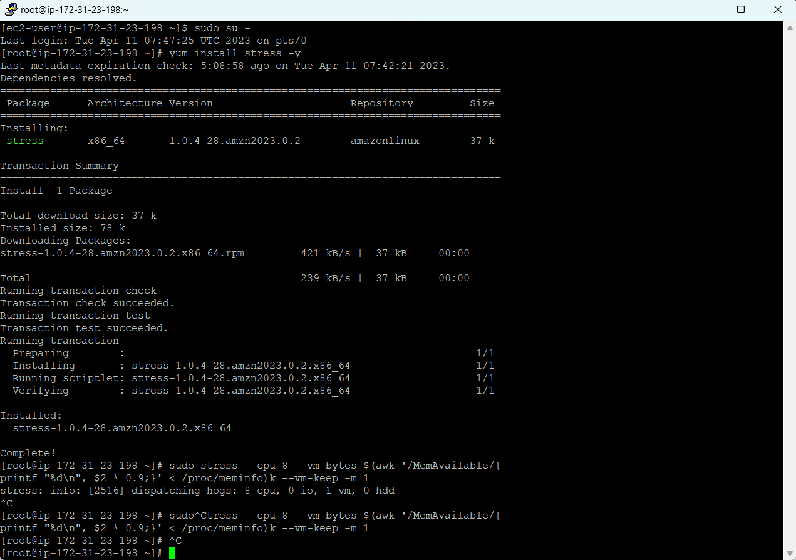
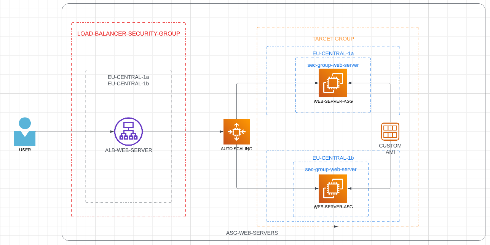
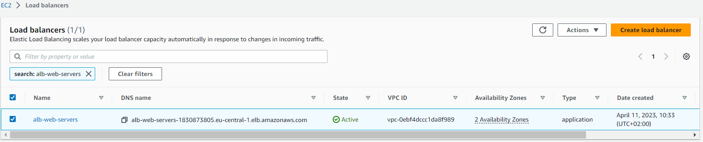

### TASK no. 7

    Description: TASK-7: Autoscaling Group and Load Balancer 

    - Stavke koje su odradjene u ovom tasku:
      - [x] Kreiranje AMI image od instance `ec2-vedad-nuhic-web-server`, AMI image nazovite `ami-vedad-nuhic-web-server`.
      - [x] Kreiranje Application Load Balancer naziva `alb-web-servers` koji ce biti povezan sa Target Group `tg-web-servers`.
      - [x] Kreiranje ASG sa MIN 2 i MAX 4 instance. Tip instance koji sam koristio unutar ASG je `t2.micro` ili `t3.micro` gdje sam koristio `alb-web-servers` Load Balancer. ASG bi trebala da skalira prema gore (scale-up) kad CPU predje `18%` i skalira prema dole (scale down) kad god CPU Utilisation padne ispod `18%`.
      - [x] Security grupe dozvoljavaju najmanje potrebne otvorene portove.
      - [x] Simulirana visoka dostupnost na nacin da su terminirane instance.
      - [x] Simuliran CPU load prateci korake iz tutorijala [https://www.wellarchitectedlabs.com/performance-efficiency/100_labs/100_monitoring_linux_ec2_cloudwatch/5_generating_load/]

### Screenshots related to the task:

### AMI IMAGE

### ALB koji je povezan sa target grupom.

### ASG sa MIN 2 i MAX 4 instance.

### Simulirana velika dostupnost - zamjena unhealthy instanci

### Simuliranje CPU Load (instaliranje "stress" utility)

### Razumljivost dijagrama infrastrukture iz moje perspektive

### DNS Record Load Balancera

[http://alb-web-servers-1830873805.eu-central-1.elb.amazonaws.com/](http://alb-web-servers-1830873805.eu-central-1.elb.amazonaws.com/)

